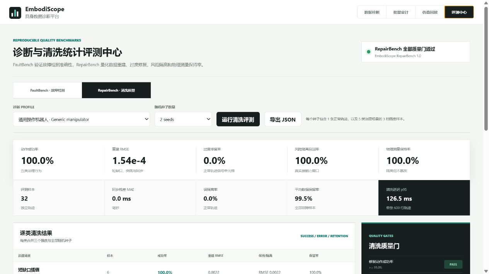
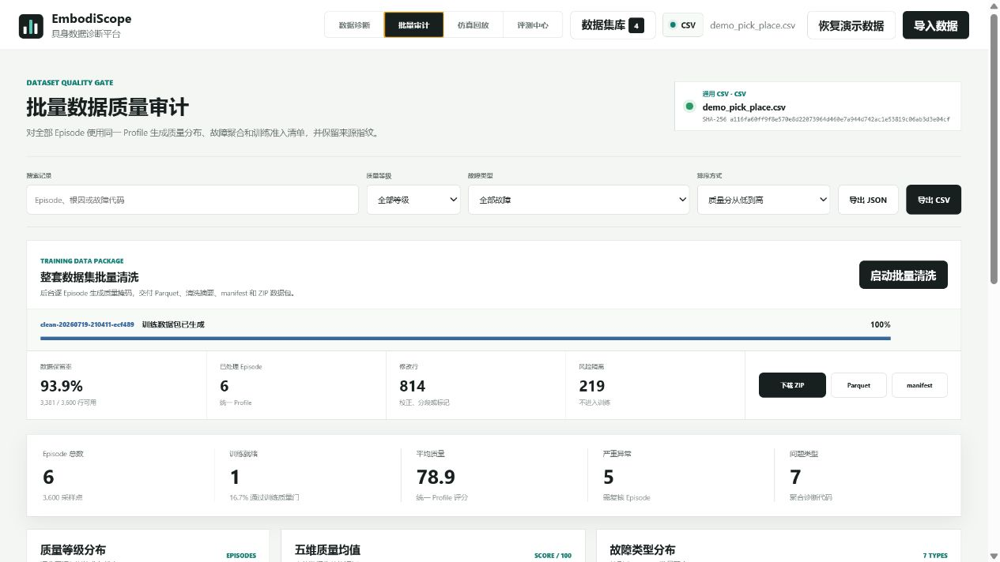

# EmbodiScope

面向具身智能实验的**数据质量审计、多模态同步诊断与失败根因分析平台**。

当前版本：`v2.3.0`

## 考核快速入口

> **核心主张：** EmbodiScope 将具身实验失败从分散日志转化为可复现、可诊断、可恢复验证的证据闭环。

在项目根目录执行以下命令，脚本会复用或启动 `8876` 端口服务，并自动检查关键 API、正式评测结果和答辩材料：

```powershell
powershell -ExecutionPolicy Bypass -File scripts\assessment_start.ps1
```

浏览器访问 [http://127.0.0.1:8876/](http://127.0.0.1:8876/)。完整自动化验收使用：

```powershell
powershell -ExecutionPolicy Bypass -File scripts\assessment_start.ps1 -RunTests
```

现场演示建议按“`仿真回放` -> `任务推理` -> `恢复实验`”依次展示：先核对故障注入、视频、数字孪生与力觉证据，再查看首个失效谓词和局部恢复计划，最后用相同环境、种子和故障条件下的 Failure/Recovered 配对回放验证恢复是否真实有效。

| 正式证据 | 结果 |
|---|---:|
| FaultBench Macro F1 | `98.4%` |
| RepairBench 修复动作成功率 | `100.0%` |
| RecoveryBench 严格任务恢复 | `8/9 = 88.9%` |
| RecoveryBench Wilson 95% CI | `56.5%-98.0%` |
| 完整 Episode 安全率 / 干预后安全率 | `66.7% / 100.0%` |
| 在线触发覆盖 / 配对完整率 | `100.0% / 100.0%` |
| 恢复延迟 p95 | `3.93 s` |

正式 RecoveryBench 使用 `seed=7,9,10`。`seed=8` 因受控故障签名缺失在分析前公开排除；`collision / seed=10` 因 Failure 组同样完成任务、没有产生任务成功的反事实增益，保留为严格失败。任务成功与安全性始终分开报告。

- [v2.3 答辩 PPT](docs/EmbodiScope_Assessment_Deck_v2.3.pptx)
- [3 分钟演示路径与 15 分钟讲稿](docs/demo_script.md)
- [备用演示视频](docs/EmbodiScope_Assessment_Demo_v2.3.mp4)
- [答辩高频问题](docs/assessment_qa.md)
- [考核交付清单](docs/assessment_submission.md)
- [原创与第三方开源边界](THIRD_PARTY_NOTICES.md)
- [v2.3 版本说明](CHANGELOG.md)

机器人实验数据通常同时包含关节状态、末端位姿、相机、力传感器和任务标签。人工排查一次失败实验，需要在多个日志工具之间反复对齐时间轴。EmbodiScope 将这套流程统一为可重复的闭环：既可以导入 CSV、LeRobot Dataset、ManiSkill HDF5、ROS/ROS2 bag 或 MCAP，也可以直接启动真实 ManiSkill + SAPIEN + PhysX 仿真，注入碰撞、视觉延迟和连续丢帧，随后同步回放视频、Panda 数字孪生、控制与接触力信号，并一键送入诊断引擎。

## 核心能力

- 数据完整性：缺失值、受影响通道与缺失比例检查
- 时序健康度：重复/倒序时间戳、采样缺口与周期抖动检查
- 运动合理性：关节突跳、长时间卡滞与工作空间越界检测
- 多模态同步：通过末端速度和图像运动强度互相关估计时间偏移
- 执行安全性：异常接触力、抓取滑脱和潜在危险轨迹检测
- 失败分析：融合多个诊断证据，给出根因优先级与修复建议
- 报告导出：一键生成 Markdown 诊断报告，也支持 CLI 批量分析
- 空间回放：Three.js 同步展示末端轨迹、TCP 时间游标和异常位置
- Rerun 导出：生成 `.rrd`，在 Rerun Viewer 中联动查看三维轨迹、关节、力觉和诊断事件
- 开源生态接入：原生识别 LeRobot、ManiSkill、ROS1/ROS2 和 MCAP，并统一映射为诊断 Schema
- 真实仿真闭环：运行 `PickCube-v1`，基准控制器可完成接近、抓取并将方块移动到目标位姿
- 十场景压力矩阵：覆盖碰撞、滑脱、夹爪失效、执行器卡滞、动态目标扰动、视觉延迟、丢帧、遮挡和复合故障
- 同步回放：H.264 视频、Three.js Panda、时间游标、动作/力觉遥测和诊断事件使用同一时间轴
- 工程化作业：后台执行、进度轮询、取消、HTTP Range 视频流、安全产物访问和一键诊断导入
- 多来源数据集库：内置 4 个可切换数据源，共 `214` 条 Episode、`30,450` 个采样点
- Hugging Face 开源数据：集成 LeRobot PushT 的 `206` 条 Episode、`25,650` 个采样点与 RGB 视频
- 数据集视频回放：按 Episode 元数据切分合并 MP4，并与局部时间游标同步播放
- 统计评测中心：七类故障、三档强度和多随机种子统一计算 Precision、Recall、F1、误报率、定位误差与 p95 延迟
- RepairBench 清洗评测：五类修复、三档强度和正常轨迹共同量化成功率、重建误差、同步残差、风险隔离与过度修复
- 具身策略就绪度：基于 observation/action/next-state/contact/outcome 闭环评估数据是否适合策略学习，并显式标记状态差分代理动作
- 任务图与失败恢复：把连续轨迹落到任务谓词，检查技能前置条件、预期效果和安全不变量，并从首个失效谓词生成局部恢复算子
- RecoveryLab 配对恢复实验：在同环境、同种子、同故障、同相机和同仿真步数下，对照“不恢复”与“执行局部恢复”的真实物理结果
- 在线恢复触发：直接监视接触力、夹爪命令/响应失配和 `is_grasped` 状态转换，不依赖固定恢复步骤
- Safety-aware RecoveryBench：跨碰撞、夹爪失效、抓取滑脱和多个随机种子统计任务恢复率、整段安全率、干预后安全率与 Wilson 95% 置信区间
- 诊断 Profile：通用操作机器人与 Franka Panda 使用独立物理阈值和工作空间，并随分析结果导出完整配置
- 批量质量审计：跨 Episode 汇总等级、故障类型、五维均值、训练就绪率和最差记录排名
- 可追溯数据清洗：短缺口插值、孤立突跳修复、视觉偏移校正、时间片段切分与风险隔离
- 整套数据集交付：后台清洗全部 Episode，生成 Parquet、逐 Episode CSV、manifest 和 ZIP 训练数据包
- 数据血缘：审计 JSON/CSV、清洗产物和 manifest 同时保留来源与产物 SHA-256

具身策略就绪度的计算依据与开源项目映射见 [docs/embodied-evaluation.md](docs/embodied-evaluation.md)。

任务图、连续谓词落地与恢复规划的设计见 [docs/task-reasoning.md](docs/task-reasoning.md)。

RecoveryLab 的受控变量、指标和质量门见 [docs/recovery-lab.md](docs/recovery-lab.md)。


## 快速运行

环境要求：Python 3.10 及以上。

```powershell
cd C:\Users\wxx\Desktop\BIGAI\embodiscope
python -m pip install -r requirements.txt
python run.py
```

浏览器访问 [http://127.0.0.1:8765](http://127.0.0.1:8765)。项目内置 CSV、LeRobot Parquet、ManiSkill HDF5 和 ROS2 MCAP 四类演示数据，无需机器人或仿真器即可完整验证。

端口被占用时可以指定其他端口：`$env:EMBODISCOPE_PORT=8876; python run.py`。

### 启动真实仿真

安装仿真可选依赖：

```powershell
python -m pip install -e ".[simulation]"
```

启动 Web 服务后进入“仿真回放”，选择故障场景并点击“启动真实仿真”。也可以直接使用 CLI：

```powershell
python scripts\run_maniskill_sim.py --scenario collision --steps 40
python scripts\run_maniskill_sim.py --scenario grasp-slip --steps 80
python scripts\run_maniskill_sim.py --scenario actuator-stall --steps 80
python scripts\run_maniskill_sim.py --scenario compound-failure --steps 80
```

每次运行会生成 `trajectory.h5`、`trajectory.json`、`episode.mp4`、`replay.json` 和缩略图。轨迹额外记录策略动作、实际执行动作、归一化夹爪开度、`is_grasped` 和真实技能阶段。当前 Windows 演示配置采用 `physx_cpu + sapien_cpu`，避免部分 RTX 驱动在离屏渲染时发生访问冲突，同时保留真实物理步进、接触力和 RGB 相机画面。完整场景矩阵见 [docs/simulation-scenarios.md](docs/simulation-scenarios.md)。

### 执行 RecoveryLab 配对实验

网页进入“恢复实验”，选择碰撞、夹爪失效或抓取滑脱，系统会在同一个 `PickCube-v1` 环境中顺序运行两组轨迹：Failure 组保留故障且不执行恢复；Recovered 组保留同一故障，并在首因出现后执行局部恢复算子。两组固定相同的随机种子、仿真步数、相机和故障参数。

结果页同步回放两段 MP4，并用力觉曲线、36 N 安全线和事件轨道标出故障注入、谓词失效、恢复启动、谓词恢复与任务成功。默认协议 `seed=7 / horizon=140`；六项质量门检查配对完整性、Failure 预期失败、Recovered 任务成功、谓词恢复、有序算子完成和恢复后力峰受控。页面分别给出 `任务恢复 / 整段执行安全 / 干预后安全` 三个结论：例如碰撞后可以完成任务恢复，但发生过 36 N 以上冲击的完整 Episode 仍明确判为 `UNSAFE`。实验 JSON 写入 `output/recovery/{job_id}/result.json`，服务重启后可重新索引历史结果。

同一页面可启动 RecoveryBench。默认从 `seed=7` 起筛选 3 个有效种子；只有三个场景的 Failure/Recovered 都出现受控故障签名时才准入，环境在故障注入前提前成功的候选 seed 会连同原因写入 `excluded_seeds`，并顺延候选补足样本。有效集执行 `3 × 3 × 2 = 18` 次真实物理仿真，排除样本会产生额外预检运行。批量模式关闭 MP4 录制但保留 HDF5 与 replay 证据。结果提供总体与逐场景恢复率、安全率、在线触发覆盖率、配对完整率、恢复延迟 p95、路径开销、算子完成率、Wilson 95% 置信区间，以及 seed × scenario 证据矩阵。完整结果写入 `output/recovery-benchmark/{job_id}/result.json` 并支持重启恢复。

当前真实批测接受 `seed=7,9,10`，公开排除在故障注入前 5 帧即成功的 `seed=8`。任务恢复率为 `8/9 = 88.9%`，Wilson 95% CI 为 `56.5%-98.0%`；完整 Episode 安全率 `66.7%`，干预后安全率、在线触发覆盖率与配对完整率均为 `100%`，恢复延迟 p95 为 `3.93 s`。唯一任务恢复未通过项是 `collision / seed=10`：Failure 在碰撞后也完成任务，因此局部干预缺少任务成功上的因果增益，不能计为恢复成功。

### 运行统计评测

网页进入“评测中心”可在 FaultBench 与 RepairBench 间切换。命令行复现两套协议：

```powershell
python scripts\run_benchmark.py --seeds 8 --profile generic-manipulator
python scripts\run_repair_benchmark.py --seeds 4 --profile generic-manipulator
```

默认生成 `176` 条独立评测轨迹：每个随机种子包含 1 条正常轨迹，以及七类故障的轻微、中等、严重三档样本。当前结果为 Macro F1 `98.4%`、Macro Recall `100.0%`、正常轨迹误报率 `0.0%`；固定阈值基线 Macro F1 为 `86.1%`。完整 JSON 写入 `output/benchmark/faultbench-v1.0.json`。

RepairBench 默认生成 `64` 条轨迹：`5 类修复 × 3 档强度 × 4 个种子`，另含 4 条正常轨迹。正式结果为修复动作成功率 `100.0%`、重建 RMSE `0.00013753`、同步残差 `0.0 ms`、正常轨迹过度修复率与误隔离率均为 `0.0%`，全部 `6/6` 质量门通过。完整 JSON 写入 `output/benchmark/repairbench-v1.0.json`。




### 批量审计与可追溯清洗

网页进入“批量审计”后，系统对当前数据集全部 Episode 使用同一 Profile 计算等级分布、五维质量均值、故障频次和训练准入状态。表格支持按 Episode、根因、等级和故障代码筛选，并可导出带来源 SHA-256 的 JSON/CSV。

在单条诊断的“问题清单”中点击“生成清洗方案”，系统按保守策略输出：

- 不超过 3 个采样点且具有双侧锚点的短缺口执行时间插值；原值保存在 `__original` 列。
- 仅修复前后速度同时越界且方向相反的孤立关节突跳，持续异常不会被平滑。
- 视觉偏移按互相关估计校正；超出原始信号覆盖范围的边界行被隔离。
- 碰撞、滑脱、卡滞、越界和无效视觉帧保持真实测量，只设置 `quality_valid=false`。
- 时间缺口不补造样本，而是增加 `segment_id` 边界。

清洗 CSV 包含 `source_row / quality_valid / repair_actions / repair_reason / segment_id`；manifest 记录动作、保留率、未解决问题、完整 Profile、来源 SHA-256 和产物 SHA-256。

审计页还可以直接启动整套数据集批量清洗。作业在后台逐 Episode 执行，支持进度、取消和状态恢复，完成后提供 `cleaned.parquet`、`episode_summary.csv`、`manifest.json` 与 ZIP 下载。命令行入口：

```powershell
python scripts\run_batch_repair.py --source data\demo_pick_place.csv
```

内置 6 Episode 演示数据实测处理 `3,600` 行，修改 `814` 行、隔离 `219` 行、保留 `3,381` 行，保留率 `93.92%`；碰撞等物理测量保持原值，只通过 `quality_valid` 控制训练准入。



## 开源数据集库

点击顶部“数据集库”可以在不同来源之间切换，单次仿真导入不会再让其他数据消失。

| 数据集 | Episode | 采样点 | 模态 | 来源与许可证 |
|---|---:|---:|---|---|
| EmbodiScope 多故障基准 | 6 | 3,600 | 关节、TCP、视觉运动、力觉、夹爪、标签 | 项目内置，MIT |
| LeRobot PushT | 206 | 25,650 | RGB、二维状态、动作、奖励、任务标签 | Hugging Face `lerobot/pusht`，MIT |
| ManiSkill 碰撞轨迹 | 1 | 600 | 关节、动作、TCP、目标、接触力 | ManiSkill，Apache-2.0 |
| ROS2 MCAP 碰撞记录 | 1 | 600 | JointState、Pose、Wrench | ROS2 / MCAP，Apache-2.0 / MIT |

PushT 固定到修订 `7628202a2180972f291ba1bc6723834921e72c19`，来源、引用和 SHA-256 写在 `data/open_source/lerobot_pusht/SOURCE.json`。重新下载或离线校验：

```powershell
python scripts\fetch_open_datasets.py
python scripts\fetch_open_datasets.py --verify-only
```

下载器优先使用可访问的 Hugging Face 镜像，并回退到官方端点；所有文件在使用前执行固定哈希校验。


## 开源数据适配器

| 适配器 | 支持格式 | 使用的开源项目 | 映射内容 |
|---|---|---|---|
| 通用 CSV | `.csv` | pandas | 时间戳、Episode 与自定义信号列 |
| LeRobot Dataset v3 | `.parquet`、`.zip`、数据集目录 | Hugging Face LeRobot 约定、Apache Arrow/PyArrow | Parquet、任务、奖励、状态/动作语义、MP4 分段与 Episode 索引 |
| ROS / ROS2 / MCAP | `.bag`、`.db3`、`.mcap`、bag 目录 | rosbags、MCAP | `JointState`、`PoseStamped`、`Odometry`、`WrenchStamped`、Image 与标量话题 |
| ManiSkill | `.h5`、`.hdf5` | ManiSkill trajectory schema、h5py | actions、qpos、TCP/物体/连杆位姿、目标位置、力觉、帧有效性与任务结果 |

适配器输出统一的 `timestamp / episode_id / joint_* / action_* / ee_* / camera_motion / frame_valid / force_z` Schema，因此检测算法、三维回放与底层数据格式解耦。网页支持上传 CSV、Parquet、LeRobot ZIP、ManiSkill HDF5、MCAP 和 bag；ROS2 SQLite bag 目录与未压缩 LeRobot 目录可通过 CLI 直接分析。

## 演示数据

| Episode | 预设场景 | 预期诊断 |
|---|---|---|
| EP-001 | 正常抓取放置 | 高质量，无严重问题 |
| EP-002 | 相机滞后 160 ms | 多模态时间错位 |
| EP-003 | 运输阶段发生碰撞 | 异常接触力峰值 |
| EP-004 | 抓取后执行器卡滞 | 长时间无运动、恢复突跳 |
| EP-005 | 消息掉线与控制跳变 | 240 ms 采样缺口、关节突跳 |
| EP-006 | 抓取滑脱与传感器缺失 | 目标距离异常增大、25 个缺失值 |

重新生成确定性演示数据：

```powershell
python scripts\generate_demo_data.py
python scripts\generate_ros2_demo.py
python scripts\generate_maniskill_demo.py
```

生成结果包括：

- `data/demo_pick_place.csv`
- `data/demo_lerobot.parquet`
- `data/demo_maniskill_collision.h5` 与配套 JSON
- `data/demo_ros2_collision.mcap`
- `data/demo_ros2_mcap/` 完整 ROS2 bag 目录

## CSV 数据规范

必需列：

| 列名 | 含义 |
|---|---|
| `timestamp` | Episode 内时间戳，单位为秒 |
| `episode_id` | 实验或轨迹标识 |

推荐列：

| 列名 | 含义 |
|---|---|
| `joint_1` ... `joint_n` | 关节位置，单位为弧度 |
| `ee_x`, `ee_y`, `ee_z` | 末端位置，单位为米 |
| `camera_motion` | 相邻图像帧的运动强度 |
| `frame_valid` | 视频帧有效标记，0 表示丢帧或不可用 |
| `force_z` | Z 轴接触力，单位为牛顿 |
| `gripper` | 夹爪开度，0 为闭合、1 为张开 |
| `object_distance` | 末端与目标的距离，单位为米 |
| `phase` | `approach/reach/grasp/transport/place` 等任务阶段 |
| `success` | Episode 是否成功 |

工具采用渐进兼容策略：只有必需列也能分析；提供的信号越丰富，诊断结果越完整。

## 批量分析

```powershell
python -m embodiscope.cli data\demo_pick_place.csv --output output\reports
python -m embodiscope.cli data\demo_pick_place.csv --episode EP-003 --output output\collision
python -m embodiscope.cli data\demo_lerobot.parquet --episode 2 --output output\lerobot
python -m embodiscope.cli data\demo_maniskill_collision.h5 --episode 0 --output output\maniskill
python -m embodiscope.cli data\demo_ros2_collision.mcap --output output\mcap
```

输出包括每个 Episode 的 Markdown 报告和完整的 `analysis.json`，便于接入实验管理平台或持续集成流程。

网页“空间回放”页可直接下载 Rerun `.rrd` 文件。安装依赖后可在本地打开：

```powershell
rerun output\rerun\embodiscope_EP-003.rrd
```

## 核心方法

1. **鲁棒异常阈值**：关节速度和接触力使用 `median + k × MAD`，降低少量离群值对阈值的污染。
2. **时间同步估计**：在 ±500 ms 窗口内，对末端速度和相机运动强度执行归一化互相关；正偏移表示视觉信号滞后。
3. **卡滞检测**：在非空闲任务阶段寻找持续超过 1.2 秒的低速片段。
4. **抓取滑脱检测**：夹爪闭合期间，目标距离持续增大时形成滑脱证据。
5. **风险约束评分**：综合完整性、时序、运动、同步、安全五个维度；严重问题会触发评分上限，防止平均分掩盖致命风险。
6. **故障闭环验证**：同一个注入事件同时写入视频、HDF5、回放 JSON 和诊断事件，点击事件即可核对画面、机器人姿态和信号证据。
7. **可配置物理先验**：诊断 Profile 显式记录关节速度、接触力、卡滞时长、同步置信度与工作空间边界。
8. **统计效果验证**：FaultBench 在多随机种子和多故障强度上报告分类、定位、同步误差与运行性能，并提供固定阈值对照。
9. **修复效果验证**：RepairBench 分别检查重建、同步、分段、风险隔离和正常轨迹保护，防止只统计“执行了动作”而不验证结果。
10. **批量训练交付**：逐 Episode 清洗结果合并为带质量掩码的 Parquet，并用摘要、manifest、哈希和 ZIP 固化数据血缘。
11. **配对恢复验证**：固定环境与故障条件，只改变首因后的恢复干预，用任务、谓词、力觉和路径指标判断恢复是否真实发生。

算法与设计细节见 [docs/technical_report.md](docs/technical_report.md)。

## 提交材料

- [技术报告](docs/technical_report.md)
- [3 分钟演示路径与 15 分钟讲稿](docs/demo_script.md)
- [v2.3 最终答辩 PPT](docs/EmbodiScope_Assessment_Deck_v2.3.pptx)
- [v2.3 备用演示视频](docs/EmbodiScope_Assessment_Demo_v2.3.mp4)
- [答辩高频问题](docs/assessment_qa.md)
- [考核交付清单](docs/assessment_submission.md)
- [HTTP API 与适配器接口](docs/api.md)
- [RecoveryLab 实验协议](docs/recovery-lab.md)
- [第三方开源归属](THIRD_PARTY_NOTICES.md)
- [v2.3 版本说明](CHANGELOG.md)
- [软件引用信息](CITATION.cff)

## 项目结构

```text
embodiscope/
├── embodiscope/
│   ├── analysis.py       # 检测算法、评分与根因分析
│   ├── adapters/         # CSV、LeRobot、ManiSkill、ROS/MCAP 适配层
│   ├── benchmark.py      # FaultBench 故障注入、对照基线与统计指标
│   ├── repair_benchmark.py # RepairBench 修复注入、质量门与统计指标
│   ├── profiles.py       # 机器人诊断阈值与工作空间配置
│   ├── repair.py         # 可追溯数值校正、风险隔离与清洗产物
│   ├── batch_repair.py   # 整套数据集后台清洗与 Parquet/ZIP 打包
│   ├── dataset_library.py # 数据集白名单目录与安全切换
│   ├── cli.py            # 批处理命令行工具
│   ├── rerun_export.py   # Rerun 三维与时序记录导出
│   ├── report.py         # Markdown 报告生成
│   ├── simulation.py     # ManiSkill 闭环控制、故障注入与回放产物
│   ├── recovery_lab.py   # 配对故障/恢复实验、指标与质量门
│   ├── recovery_benchmark.py # 多场景多种子恢复统计、Wilson 区间与异步作业
│   └── server.py         # 无框架 HTTP 服务与 API
├── static/               # 自包含诊断工作台
├── scripts/              # 演示数据生成器、开源数据下载与 Benchmark 入口
├── data/                 # 演示数据、Hugging Face 开源数据与上传数据
├── tests/                # 自动化测试
├── docs/                 # 技术报告与演示脚本
├── output/               # 生成的结构化结果和报告
└── run.py                # Web 应用入口
```

## 测试

```powershell
python -m pytest
node --check static\app.js
```

测试覆盖正常轨迹、多模态错位、连续丢帧、碰撞、卡滞、时间缺口、关节突跳、抓取滑脱、夹爪执行失效、缺失数据、LeRobot v3 目录过滤、ZIP 上传、ManiSkill HDF5、Rerun、真实 ROS2 MCAP、十场景 ManiSkill 压力矩阵、采样率单位一致性、Profile 切换与 FaultBench，以及 PushT 206 Episode、视频分段、语义映射、固定 SHA-256、跨 Episode 审计、任务图与恢复规划、短缺口插值、同步校正、物理故障隔离、RepairBench 六项质量门、批量 Parquet/ZIP 交付、三类 RecoveryLab 在线触发、独立安全结论、RecoveryBench 聚合与历史结果恢复。当前 `58/58` 项自动测试通过。

## 原创设计

EmbodiScope 不是现有可视化库的简单封装。其核心设计是将“数据质量”和“任务失败”放在同一条证据链中：异常检测器不仅输出数值，还提供发生时间、三维位置、影响维度、根因候选和可执行修复建议。风险约束评分解决了传统加权平均中“碰撞轨迹仍可能获得高分”的问题，多模态同步模块直接输出可校正的时间偏移量。v1.6 将诊断结果转成保守、可逆的清洗计划；v1.7 用 RepairBench 量化清洗结果；v2.3 再把任务恢复、完整 Episode 安全和干预后安全拆成独立主张，并用 RecoveryBench 做多种子统计。FaultBench 验证诊断主张，RepairBench 验证修复主张，RecoveryBench 验证局部恢复鲁棒性且不掩盖历史安全违规。开源库负责成熟的文件解析与图形渲染；Schema 映射、ZIP 安全解包、异步话题对齐、诊断算法、评分机制、清洗策略、评测协议、回放状态机和 Rerun 语义组织均由项目实现。

## 当前局限

- LeRobot 合并视频已支持按 Episode 回放；当前只接入首个视觉 feature，尚未提供多相机并排视图。
- 仿真闭环当前开放 `PickCube-v1` 和 Panda 数值雅可比控制器，尚未扩展到多环境与多机器人批量队列。
- 网页上传限制为 25 MB；大型 bag 和 LeRobot 数据集建议使用 CLI。
- 当前只内置通用操作机器人和 Franka Panda 两个 Profile，更多机器人仍需补充 URDF 限位与传感器标定参数。
- FaultBench 使用公开可复现的轨迹扰动和真实 ManiSkill 回归，尚未包含大规模真机人工标注失败集。
- RepairBench 使用可控损坏和正常轨迹保护测试，尚需在大规模真机清洗集上补充人工复核的一致性评估。
- RecoveryBench 已覆盖三个故障和多随机种子，但仍使用同一个 `PickCube-v1` 任务与 Panda 控制器，不能替代多任务、多环境和真机上的策略泛化与安全认证。
- 根因分析基于可解释规则，尚未利用视频语义或大模型进行开放类别归因。
- 自动诊断用于提高筛查效率，不能替代真机安全控制器和人工复核。

## 开源归属

项目使用的第三方组件、许可证和职责边界见 [THIRD_PARTY_NOTICES.md](THIRD_PARTY_NOTICES.md)。

EmbodiScope 自身代码采用 [MIT License](LICENSE)。
