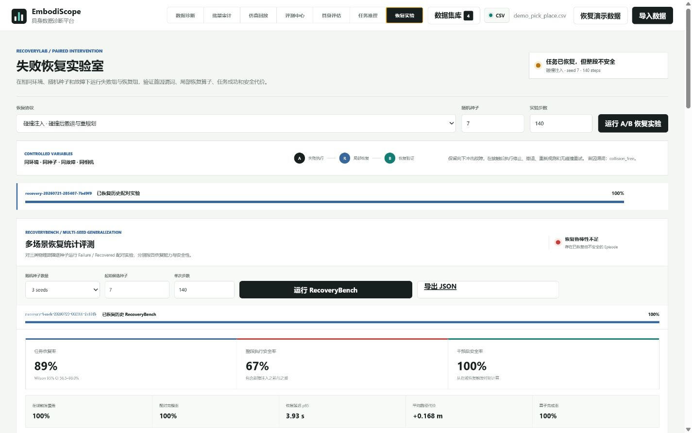
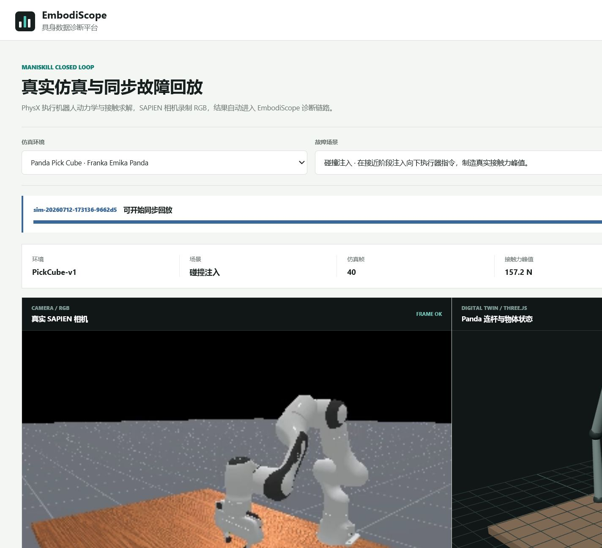
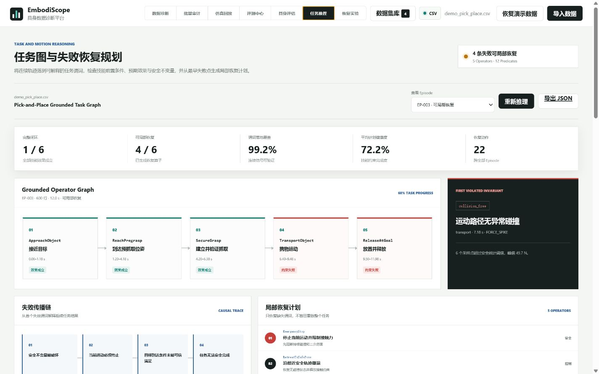
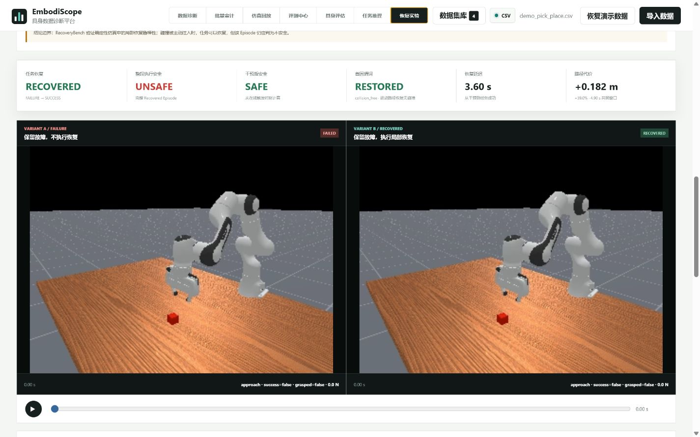
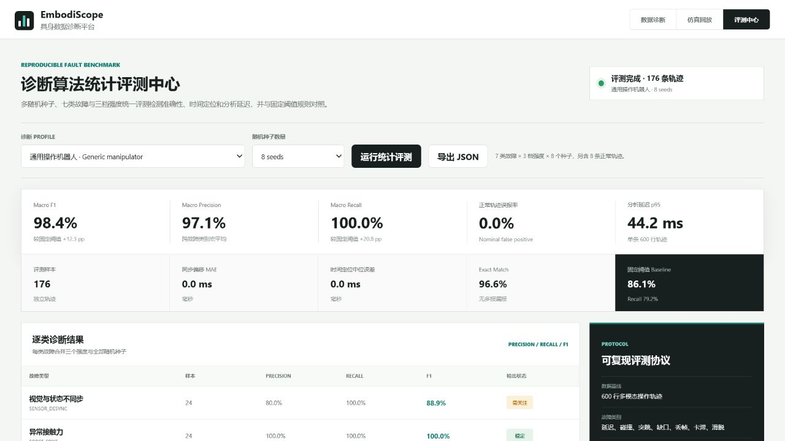
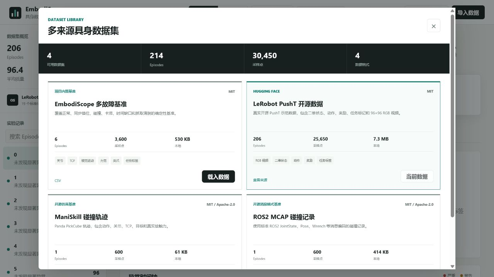

# EmbodiScope

**具身智能实验诊断与恢复验证平台**

EmbodiScope 将机器人实验中的分散日志转化为一条可复现的证据链：**多模态数据接入、故障诊断、任务谓词推理、局部恢复、配对仿真验证和统计评测**。

当前版本：`v2.3.0` · Python `3.10+` · MIT License

<p align="center">
  
</p>

## 核心能力

```text
CSV / LeRobot / ManiSkill / ROS bag / MCAP
                    ↓
数据质量审计与多模态时间对齐
                    ↓
故障根因、任务谓词与首因失效定位
                    ↓
Failure / Recovered 配对物理仿真
                    ↓
任务恢复、安全性与统计置信区间
```

- **真实物理回放**：ManiSkill + SAPIEN + PhysX，支持 10 类正常与故障场景。
- **可解释诊断**：检测碰撞、滑脱、卡滞、关节突跳、时间缺口、视觉延迟和丢帧。
- **任务级推理**：将连续状态落到 grounded predicates，定位首个失效谓词并生成局部恢复算子。
- **恢复验证**：固定环境、种子、故障、相机和步数，对比 Failure 与 Recovered。
- **数据工程闭环**：支持批量审计、保守清洗、Parquet/ZIP 交付、SHA-256 数据血缘和 Rerun 导出。

## 可视化工作台

<table>
  <tr>
    <td width="50%" align="center">
      <br>
      <b>真实仿真同步回放</b><br>
      RGB、Panda 数字孪生、力觉和故障事件共用时间轴
    </td>
    <td width="50%" align="center">
      <br>
      <b>任务图与失败恢复规划</b><br>
      Operator、Predicate、首因失效与局部恢复计划
    </td>
  </tr>
  <tr>
    <td width="50%" align="center">
      <br>
      <b>RecoveryLab 配对实验</b><br>
      同条件 Failure / Recovered 动态回放与物理证据
    </td>
    <td width="50%" align="center">
      <br>
      <b>FaultBench 与 RepairBench</b><br>
      故障检测、修复质量、基线对照和质量门
    </td>
  </tr>
  <tr>
    <td colspan="2" align="center">
      <br>
      <b>多来源数据集库</b><br>
      内置 4 个来源、214 条 Episode、30,450 个采样点
    </td>
  </tr>
</table>

## 正式结果

| 评测 | 指标 | 结果 |
|---|---|---:|
| FaultBench | Macro F1 | **98.4%** |
| FaultBench | 正常轨迹误报率 | **0.0%** |
| RepairBench | 修复动作成功率 | **100.0%** |
| RepairBench | 质量门 | **6/6** |
| RecoveryBench | 严格任务恢复 | **8/9，88.9%** |
| RecoveryBench | Wilson 95% CI | **56.5%-98.0%** |
| RecoveryBench | 完整 Episode 安全率 | **66.7%** |
| RecoveryBench | 干预后安全率 | **100.0%** |
| RecoveryBench | 在线触发覆盖 / 配对完整率 | **100.0% / 100.0%** |
| RecoveryBench | 恢复延迟 p95 | **3.93 s** |

正式 RecoveryBench 使用 `seed=7,9,10`。`seed=8` 因未出现受控故障签名而在分析前排除；`collision / seed=10` 因 Failure 组同样完成任务、没有产生任务成功的反事实增益，保留为严格失败。任务成功与安全性独立报告。

## 快速启动

在项目根目录执行：

```powershell
python -m pip install -r requirements.txt
powershell -ExecutionPolicy Bypass -File scripts\assessment_start.ps1
```

访问 [http://127.0.0.1:8876/](http://127.0.0.1:8876/)。脚本会自动启动或复用服务，并检查关键 API、答辩材料和正式评测结果。

完整验收：

```powershell
powershell -ExecutionPolicy Bypass -File scripts\assessment_start.ps1 -RunTests
```

安装真实仿真依赖：

```powershell
python -m pip install -e ".[simulation]"
```

## 三分钟演示路径

1. **仿真回放**：运行“碰撞注入”，展示 RGB、数字孪生、接触力峰值和诊断事件同步。
2. **任务推理**：查看 `collision_free` 首因失效、失败传播链和 5 步局部恢复计划。
3. **恢复实验**：展示 Failure / Recovered 配对回放，以及任务恢复、整段安全和干预后安全三个独立结论。

完整讲稿见 [docs/demo_script.md](docs/demo_script.md)。

## 数据与适配器

| 来源 | 支持格式 | 主要内容 |
|---|---|---|
| 通用表格 | CSV | 时间戳、Episode、关节、TCP、力觉、任务标签 |
| Hugging Face LeRobot | Parquet、ZIP、目录 | 状态、动作、奖励、任务、RGB 视频 |
| ManiSkill | HDF5 | 动作、qpos、TCP、物体位姿、目标、接触力 |
| ROS / ROS2 | bag、DB3、MCAP | JointState、Pose、Odometry、Wrench、Image |

内置 LeRobot PushT 数据固定到修订 `7628202a2180972f291ba1bc6723834921e72c19`，来源和 SHA-256 记录在 [`SOURCE.json`](data/open_source/lerobot_pusht/SOURCE.json)。

## 项目结构

```text
embodiscope/   核心诊断、修复、评测、任务推理与仿真逻辑
static/        Web 工作台、Three.js 回放与交互界面
scripts/       数据生成、Benchmark、仿真和考核预检入口
tests/         58 项自动化测试
data/          演示数据与固定版本开源数据
output/        正式 Benchmark 和配对恢复证据
docs/          技术报告、答辩材料、讲稿、视频与截图
```

## 考核材料

- [v2.3 答辩 PPT](docs/EmbodiScope_Assessment_Deck_v2.3.pptx)
- [备用演示视频](docs/EmbodiScope_Assessment_Demo_v2.3.mp4)
- [15 分钟讲稿与 3 分钟演示路径](docs/demo_script.md)
- [答辩高频问题](docs/assessment_qa.md)
- [技术报告](docs/technical_report.md)
- [RecoveryLab 实验协议](docs/recovery-lab.md)
- [考核交付清单](docs/assessment_submission.md)

## 原创与开源边界

ManiSkill、SAPIEN、PhysX、PyArrow、rosbags、Three.js 和 Rerun 提供物理环境、格式解析与渲染基础设施。EmbodiScope 自行实现统一诊断 Schema、异步时间对齐、故障检测、风险约束评分、保守清洗、任务谓词落地、配对恢复协议、三套 Benchmark 和 Web 回放状态机。

BehaviorTree.CPP、MoveIt Task Constructor、PDDLStream 和 py_trees 仅作为方法参考，不是运行依赖，也没有复制其规划器实现。完整归属见 [THIRD_PARTY_NOTICES.md](THIRD_PARTY_NOTICES.md)。

## 当前边界

- RecoveryBench 当前验证 `PickCube-v1`、Franka Panda 和三类受控故障。
- 结果不等价于多任务泛化、跨机器人泛化或真机安全认证。
- 根因分析当前以可解释规则为主，开放类别视频语义仍是后续方向。

## 开发与测试

```powershell
python -m pytest
node --check static\app.js
```

当前自动化测试：`58/58` 通过。

版本记录见 [CHANGELOG.md](CHANGELOG.md)，引用信息见 [CITATION.cff](CITATION.cff)。

## License

[MIT](LICENSE) © 2026 Xiaoxu Wang
