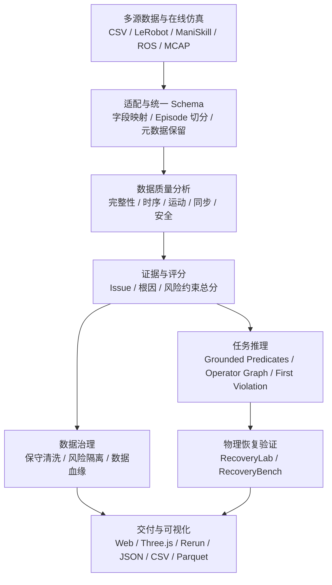
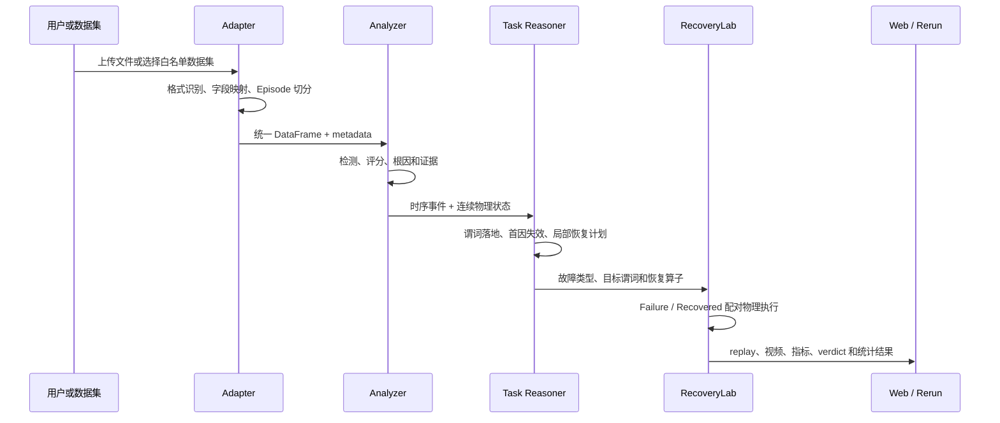
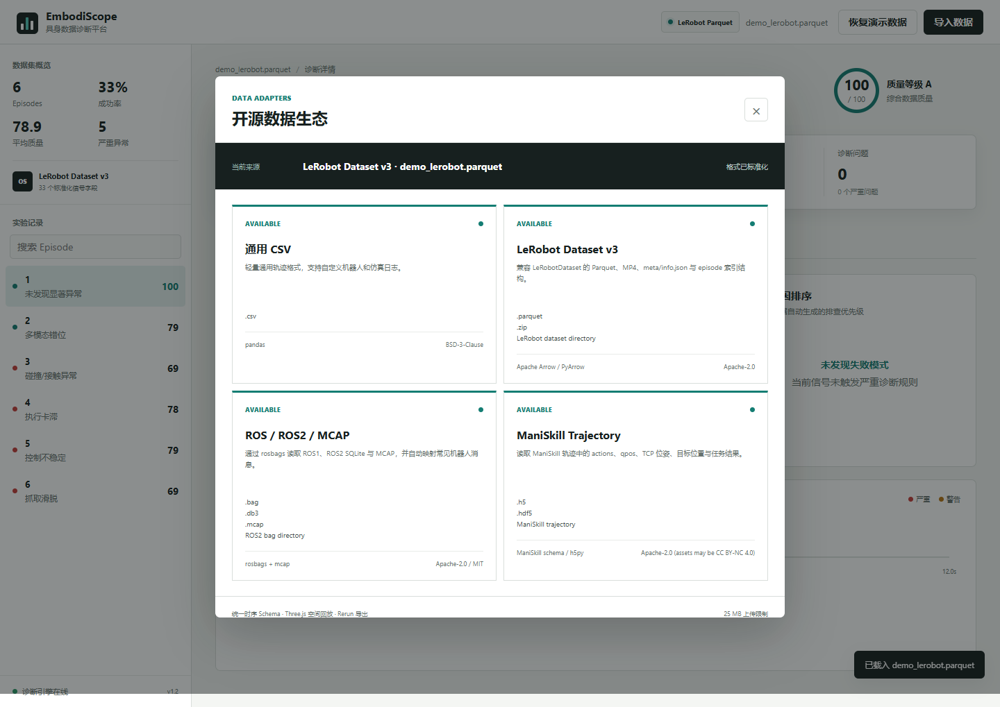
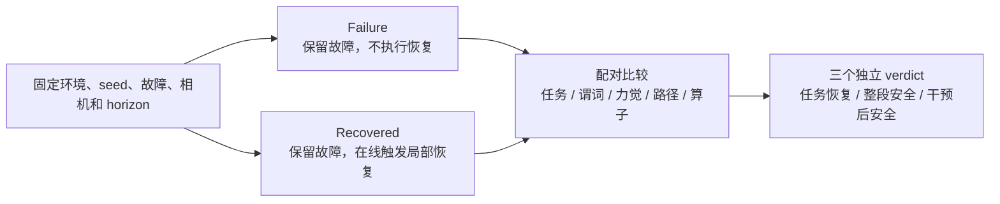

# EmbodiScope 技术报告

> 具身智能实验诊断与恢复验证平台

| 项目项 | 内容 |
|---|---|
| 项目版本 | EmbodiScope v2.3.0 |
| 报告日期 | 2026-07-23 |
| 代码仓库 | <https://github.com/wxx7777/EmbodiScope> |
| 正式 RecoveryBench | `recovery-bench-20260723-002311-2c10fb` |
| 核心主张 | 将具身实验失败从分散日志转化为可复现、可诊断、可恢复验证的证据闭环 |

## 摘要

具身智能系统的失败通常同时涉及感知、时序、控制、接触、任务状态和数据记录。仅查看最终 `success` 标签，无法区分机器人真实执行失败、传感器记录异常、控制器响应异常和任务约束被破坏；仅生成一段恢复建议，也无法证明恢复动作真正改变了物理结果。EmbodiScope 面向这一缺口，实现了从多源轨迹接入、统一数据建模、故障检测、任务谓词推理、保守数据修复，到配对物理仿真和统计恢复评测的完整平台。

系统支持 CSV、Hugging Face LeRobot、ManiSkill HDF5、ROS bag、ROS2 DB3 和 MCAP。所有数据经过统一 Schema 后进入完整性、时序、运动、同步和安全五维分析；诊断结果进一步落到 grounded predicates 和技能算子图，用于定位首个失效谓词并生成局部恢复计划。RecoveryLab 在相同环境、随机种子、故障和仿真预算下顺序运行 Failure 与 Recovered 两组真实 ManiSkill/SAPIEN/PhysX 仿真，以配对反事实实验验证恢复是否有效。Safety-aware RecoveryBench 将任务恢复、完整 Episode 安全和干预后安全拆分为三个独立结论，避免用最终成功掩盖已经发生的危险事件。

当前数据集库包含 4 个来源、214 条 Episode 和 30,450 个采样点。FaultBench 在 176 条轨迹上取得 98.4% Macro F1；RepairBench 在 64 条轨迹上通过 6/6 质量门；RecoveryBench 在 9 个有效配对上取得 8/9，即 88.9% 的严格任务恢复率，Wilson 95% 置信区间为 56.5%-98.0%，完整 Episode 安全率为 66.7%，干预后安全率为 100%。这些结果证明了系统在当前受控任务上的工程有效性，但不被解释为跨任务、跨机器人或真机安全认证。

**关键词：** 具身智能；机器人数据质量；多模态同步；故障诊断；任务谓词；局部恢复；物理仿真；反事实评测

## 1. 项目背景与问题定义

### 1.1 具身实验失败不是单一标签问题

一次机器人操作 Episode 可能同时产生：

- 策略输出的动作与实际执行动作；
- 关节位置、关节速度、末端位姿和夹爪开度；
- RGB、深度、视觉运动和帧有效性；
- 接触力、碰撞状态、物体位姿和抓取状态；
- 技能阶段、奖励、终止原因和任务成功标签。

这些信号由不同设备、进程和时钟产生。工程中常见的失败包括视觉延迟、连续丢帧、时间戳缺口、关节突跳、执行器卡滞、碰撞、夹爪响应失效和抓取滑脱。它们可能相互传播，例如“视觉延迟 -> 目标状态过期 -> 抓取位姿错误 -> 接触力升高 -> 任务失败”。因此，问题不能被简化为对单条曲线做阈值判断。

### 1.2 传统排查流程的缺口

传统流程通常由多个独立工具组成：先检查 CSV，再播放视频，再绘制力觉曲线，最后人工对齐时间并记录失败原因。该流程存在四个核心问题：

1. **数据语义不统一。** 同一信号在 CSV、HDF5、Parquet 和 ROS 消息中具有不同字段与维度。
2. **时空证据割裂。** 视频中的碰撞画面、曲线中的力峰值和三维轨迹中的异常位置无法共用时间游标。
3. **诊断与恢复脱节。** 系统可以输出“建议重新抓取”，但没有验证恢复动作是否真实执行、是否恢复谓词、是否最终成功。
4. **成功与安全混淆。** 机器人可能在危险碰撞后仍然完成任务，最终 `success=true` 不能证明完整过程安全。

### 1.3 项目研究问题

EmbodiScope 围绕以下问题展开：

- 如何用统一数据契约接入异构机器人轨迹？
- 如何在存在异常值的日志上稳定检测故障，并给出可定位证据？
- 如何把连续传感器信号转化为任务谓词和首因失效？
- 如何只修复可验证的数据错误，同时保留真实物理失败？
- 如何证明局部恢复在同一故障条件下产生了反事实增益？
- 如何独立评估任务恢复、安全历史和干预后的安全性？

## 2. 设计目标与结论边界

### 2.1 设计目标

| 目标 | 设计要求 |
|---|---|
| 多源接入 | 不同格式映射到同一 DataFrame Schema，诊断逻辑不依赖原始格式 |
| 可解释诊断 | 每个问题包含代码、等级、时间范围、数值证据、根因解释和建议 |
| 风险感知评分 | 严重安全问题不能被其他高分维度平均掩盖 |
| 保守修复 | 只校正短缺口、孤立突跳和高置信同步偏移，不篡改真实碰撞与滑脱 |
| 任务级推理 | 从连续状态构建谓词、技能算子、首因失效和恢复计划 |
| 物理恢复验证 | Failure 与 Recovered 保留同一故障，仅改变首因后的局部干预 |
| 统计可复现 | 固定协议、随机种子、阈值、版本、哈希和正式 JSON 产物 |
| 可视化证据 | RGB、三维数字孪生、时序曲线、事件和恢复算子共用时间语义 |

### 2.2 非目标

当前版本不声称：

- 已学习通用恢复策略；
- 已证明跨任务、跨机器人或跨仿真器泛化；
- 已达到真机功能安全认证；
- 已解决开放世界视频语义理解；
- RecoveryBench 的有限样本点估计等价于大样本统计结论。

报告后续所有结论均区分“已实现”“已验证”“方法参考”和“未来工作”。

## 3. 总体架构

### 3.1 分层架构



### 3.2 核心模块

| 模块 | 主要实现 | 职责 |
|---|---|---|
| 数据适配 | `embodiscope.adapters` | 格式识别、字段展开、时间标准化、元数据读取 |
| 诊断分析 | `embodiscope.analysis` | 故障检测、证据生成、五维评分与根因排序 |
| Profile | `embodiscope.profiles` | 统一管理统计阈值、物理下限和机器人约束 |
| 数据集治理 | `embodiscope.dataset_library` | 白名单目录、来源、许可证、规模和安全切换 |
| 数据修复 | `embodiscope.repair` | 校正、分段、隔离、原值备份和 manifest |
| 批量交付 | `embodiscope.batch_repair` | 后台作业、Parquet、摘要、manifest 和 ZIP |
| 故障评测 | `embodiscope.benchmark` | FaultBench 故障注入、基线对照和统计指标 |
| 修复评测 | `embodiscope.repair_benchmark` | RepairBench 重建误差、风险隔离和过度修复评估 |
| 具身契约 | `embodiscope.embodied` | observation/action/next-state/contact/outcome 数据就绪度 |
| 任务推理 | `embodiscope.task_reasoning` | 谓词落地、任务图、首因和恢复算子 |
| 物理仿真 | `embodiscope.simulation` | ManiSkill 闭环控制、故障注入、视频和 replay |
| 恢复实验 | `embodiscope.recovery_lab` | Failure/Recovered 配对、质量门和三类 verdict |
| 恢复评测 | `embodiscope.recovery_benchmark` | 多场景多种子准入、聚合和 Wilson 区间 |
| 服务接口 | `embodiscope.server` | HTTP API、Range 视频、上传校验和产物访问 |
| 可视化 | `static/`、`embodiscope.rerun_export` | Web 工作台、Three.js 数字孪生和 Rerun 导出 |

### 3.3 端到端数据流



## 4. 统一数据层

### 4.1 Schema 设计

所有适配器至少输出以下必需字段：

| 字段 | 类型 | 语义 |
|---|---|---|
| `timestamp` | `float` | Episode 内相对时间，单位为秒 |
| `episode_id` | `string` | 轨迹、实验或示范标识 |

可选标准字段按能力渐进启用：

| 字段组 | 典型字段 | 用途 |
|---|---|---|
| 关节状态 | `joint_*` | 速度、突跳、卡滞和越界分析 |
| 策略动作 | `action_*` | 动作意图、动作幅值和执行差异 |
| 末端位姿 | `ee_x/y/z` | 空间轨迹、速度和工作空间约束 |
| 视觉状态 | `camera_motion`、`frame_valid` | 多模态同步、丢帧和遮挡分析 |
| 接触状态 | `force_z` 或力模长 | 力峰值、碰撞和安全不变量 |
| 夹爪与目标 | `gripper`、`object_distance` | 抓取建立、滑脱和接近状态 |
| 任务语义 | `phase`、`success`、`reward` | 技能阶段、终止和任务结果 |

Schema 的核心原则是“统一语义，不伪造信息”。例如 PushT 的 `observation.state` 是二维像素坐标，不会被误解释为机器人关节角；缺少任务成功标签时保持“未标注”，不生成虚假的失败根因。

### 4.2 适配器契约

所有适配器实现统一协议：

```python
class DatasetAdapter(Protocol):
    info: AdapterInfo

    def can_load(self, path: Path) -> bool: ...
    def load(self, path: Path) -> LoadedDataset: ...
```

`LoadedDataset` 返回标准 DataFrame、来源格式、适配器身份、元数据和非致命警告。新增数据格式时只需实现协议并在注册表中登记，分析器、Web API、任务推理和评测逻辑不需要修改。



### 4.3 四类正式数据来源

| 来源 | 格式 | Episode | 采样点 | 主要模态 |
|---|---|---:|---:|---|
| EmbodiScope 多故障基准 | CSV | 6 | 3,600 | 关节、TCP、视觉运动、力觉、夹爪、任务标签 |
| Hugging Face LeRobot PushT | Parquet + MP4 | 206 | 25,650 | RGB、二维状态、动作、奖励、任务文本 |
| ManiSkill 碰撞轨迹 | HDF5 | 1 | 600 | 动作、关节、TCP、目标、接触力 |
| ROS2 MCAP 碰撞记录 | MCAP | 1 | 600 | JointState、Pose、Wrench |
| **合计** | 4 个来源 | **214** | **30,450** | 多模态具身轨迹 |

LeRobot PushT 固定到修订：

```text
7628202a2180972f291ba1bc6723834921e72c19
```

版本、许可证、来源 URL 和 SHA-256 均写入来源清单，避免上游数据更新导致结果漂移。

### 4.4 格式映射要点

- **LeRobot：** 读取 episode Parquet、任务元数据和合并视频偏移；排除 `meta/episodes` 统计文件，避免将其误当作轨迹。
- **ManiSkill：** 读取 actions、qpos、TCP、目标位置、物体位姿、接触力和任务结果。
- **ROS/MCAP：** 使用 rosbags 和 MCAP 反序列化标准消息，并按异步话题对齐到统一时间轴。
- **CSV：** 支持向量字段展开、别名匹配、类型转换、时间排序和 Episode 切分。

## 5. 数据质量诊断方法

### 5.1 分析输出模型

每个诊断问题使用结构化 `Issue` 表达，至少包含：

- 问题代码和类别；
- `warning` 或 `critical` 等级；
- 起止时间与受影响行；
- 数值证据和阈值；
- 面向任务的解释；
- 建议的修复、隔离或复查动作。

这种设计使同一诊断结果可以同时驱动 Web 可视化、Markdown 报告、数据清洗、任务推理和 Benchmark，而不是在不同界面重复实现规则。

### 5.2 鲁棒异常阈值

对关节速度和接触力采用中位数绝对偏差 MAD：

$$
\operatorname{MAD}(x)=\operatorname{median}(|x-\operatorname{median}(x)|)
$$

$$
T=\max\left(T_{floor},\operatorname{median}(x)+k\cdot1.4826\cdot\operatorname{MAD}(x)\right)
$$

其中 `k` 和物理下限 `T_floor` 由 AnalysisProfile 管理。MAD 相比均值和标准差更不容易被少数极端值拉高；物理下限则避免静止轨迹产生不合理的低阈值。

关节速度统一按真实时间差计算：

$$
\dot q_i(t)=\frac{q_i(t)-q_i(t-1)}{t_i-t_{i-1}}
$$

因此同一运动在 10 Hz 和 100 Hz 日志中保持一致的 `rad/s` 语义。

### 5.3 多模态同步估计

系统从末端位置计算速度模长 $v(t)$，与视觉运动 $m(t)$ 标准化后，在 $\pm500$ ms 窗口内枚举偏移：

$$
\hat\tau=\arg\max_{\tau\in[-0.5,0.5]}\operatorname{corr}(z(v(t)),z(m(t+\tau)))
$$

最大相关系数作为同步置信度，$\hat\tau$ 作为估计偏移。正值表示相机信号晚于机器人状态。该方法利用“机器人运动应引起画面变化”的跨模态共有事件，不依赖额外硬件同步标记。

### 5.4 任务阶段感知的卡滞检测

低速并不必然等于卡滞。系统先排除 `idle` 和 `reset` 等阶段，再检查末端速度低于 `0.004 m/s` 且持续至少 `1.2 s` 的片段。通过阶段语义约束，等待、抓取闭合和正常停稳不会被直接判定为 `ROBOT_STUCK`。

### 5.5 核心故障类型

| 问题代码 | 主要证据 | 解释 |
|---|---|---|
| `SENSOR_DESYNC` | 视觉运动与末端速度最佳偏移 | 视觉和机器人状态时钟不一致 |
| `FORCE_SPIKE` | 接触力超过鲁棒阈值与物理下限 | 碰撞或异常冲击 |
| `JOINT_JUMP` | 关节速度出现孤立异常边 | 控制突跳、编码异常或日志损坏 |
| `TIMESTAMP_GAP` | 相邻时间差超过周期约束 | 采集阻塞、消息丢失或分段 |
| `FRAME_DROP` | 连续无效帧或重复画面 | 相机采集失败或遮挡 |
| `ROBOT_STUCK` | 活跃阶段持续低速 | 执行器卡滞或技能进展中断 |
| `GRASP_SLIP` | 闭合夹爪下目标距离增大或抓取状态丢失 | 抓取未保持 |
| `GRIPPER_RESPONSE_FAILURE` | 闭合命令与实际开度持续失配 | 执行器未响应策略意图 |

### 5.6 风险约束评分

基础质量分由五个维度加权：

$$
Q_0=0.22Q_c+0.20Q_t+0.20Q_m+0.18Q_s+0.20Q_{safe}
$$

其中 $Q_c$、$Q_t$、$Q_m$、$Q_s$ 和 $Q_{safe}$ 分别表示完整性、时序、运动、同步和安全得分。随后应用风险上限：

$$
Q=\min(Q_0,C_{critical},C_{dimension})
$$

- 出现严重问题时，`C_critical = 79`；
- 任一维度低于 40 时，`C_dimension = 69`；
- 未触发约束时相应上限为 100。

该机制避免“其他信号完整，所以发生碰撞的轨迹仍有 90 分”的不合理结果。

### 5.7 根因证据链

系统不只输出异常集合，还按时间和任务语义组织证据：

```text
最早异常事件
  -> 受影响物理谓词
  -> 当前技能前置条件或不变量失效
  -> 后续任务状态传播
  -> 局部恢复目标与验证条件
```

根因排序优先使用具有明确时间定位的关键事件，再结合故障类别、任务阶段、任务成功和后续传播关系，避免仅按异常幅值排序。

## 6. 保守修复与数据血缘

### 6.1 三类治理动作

| 动作 | 适用问题 | 行为 |
|---|---|---|
| `correction` | 短缺口、孤立突跳、高置信视觉偏移 | 局部校正并保留原值 |
| `segmentation` | 时间戳长缺口 | 建立新 `segment_id`，不补造样本 |
| `quarantine` | 碰撞、卡滞、滑脱、越界、无效视觉帧 | 设置 `quality_valid=false`，保留真实测量 |

物理失败与数据损坏被明确区分。碰撞力峰、滑脱轨迹和执行器卡滞属于真实物理事实，系统不会为了得到“干净曲线”而修改它们。

### 6.2 行级审计字段

清洗结果增加：

| 字段 | 作用 |
|---|---|
| `source_row` | 指向原始数据行 |
| `quality_valid` | 训练数据质量门 |
| `repair_actions` | 本行执行的校正、分段或隔离动作 |
| `repair_reason` | 触发决策的问题代码 |
| `segment_id` | 时间连续片段编号 |
| `{column}__original` | 被修改信号的原始值备份 |

### 6.3 双哈希与产物交付

manifest 同时记录源数据 SHA-256 和清洗产物 SHA-256，并保存 AnalysisProfile、问题变化、影响时间范围、保留率和内部产物哈希。批量作业输出：

```text
cleaned.parquet
episode_summary.csv
manifest.json
package.zip
```

训练流水线只读取 `quality_valid == true` 的样本，但审计人员仍可从原始信号、备份列和 manifest 还原每次质量决策。


## 7. 具身任务数据契约

EmbodiScope 不把机器人数据集仅视为时间序列表，而是检查策略学习所需的五元关系：

$$
(o_t,a_t,o_{t+1},c_t,y_t)
$$

其中 $o_t$ 为观测，$a_t$ 为动作，$o_{t+1}$ 为下一状态，$c_t$ 为接触或安全上下文，$y_t$ 为任务结果。平台检查字段覆盖、时间连续性、动作与状态对应、任务标签和接触证据，给出策略训练就绪度。

这一层连接了“日志质量”和“具身学习可用性”：一条格式正确的轨迹，如果缺失动作、下一状态或任务结果，仍不能被视为完整的策略训练样本。

## 8. ManiSkill 物理仿真闭环

### 8.1 运行时与控制器

仿真环境使用：

- ManiSkill 3.0.1；
- SAPIEN 3.0.3；
- PhysX CPU 物理后端；
- Franka Emika Panda；
- `PickCube-v1`；
- `pd_joint_delta_pos` 控制模式。

控制器使用有限差分数值雅可比和阻尼最小二乘求解关节增量：

$$
\Delta q=J^T(JJ^T+\lambda I)^{-1}e
$$

其中 $e$ 为 TCP 到目标的三维位置误差，$\lambda=0.03$ 为阻尼项。动作经过阶段增益和幅值裁剪后发送给 Panda。该实现不依赖额外的 Pinocchio 安装，便于考核环境复现。

### 8.2 记录信号

每个物理步记录：

- 策略动作与实际执行动作；
- 7 轴关节状态和夹爪实际开度；
- TCP、物体、目标和所有连杆位置；
- 最大接触力、抓取状态、奖励和成功状态；
- 技能阶段、故障注入事件和恢复事件；
- 可选 SAPIEN RGB 帧。

轨迹同时导出 HDF5、replay JSON 和 MP4，再由正式 ManiSkill 适配器重新读入诊断流程，形成“仿真 -> 数据 -> 诊断 -> 回放”的闭环。

### 8.3 十场景故障矩阵

| 场景 | 类别 | 真实注入或变化 | 预期证据 |
|---|---|---|---|
| `nominal` | 基准 | 完整接近、抓取和运输 | `TASK_SUCCESS`、持续抓取 |
| `collision` | 接触安全 | 接近阶段向下冲击 | `FORCE_SPIKE`、碰撞位置 |
| `grasp-slip` | 任务执行 | 抓取后施加 60 N 横向力 | `GRASP_SLIP`、抓取状态丢失 |
| `gripper-failure` | 控制 | 闭合意图存在但夹爪保持张开 | 命令-响应失配、抓取未建立 |
| `actuator-stall` | 控制 | 控制增量冻结 1.5 s | `ROBOT_STUCK`、技能中断 |
| `object-perturbation` | 任务执行 | 接近阶段移动目标方块 | 目标位姿变化、闭环重定位 |
| `sensor-delay` | 感知时序 | RGB 延迟 200 ms | `SENSOR_DESYNC` |
| `frame-drop` | 感知时序 | 连续 6 帧重复并标记无效 | `FRAME_DROP` |
| `camera-occlusion` | 感知时序 | 抓取窗口遮挡 10 帧 | 遮挡窗口、物理状态与视觉失效分离 |
| `compound-failure` | 复合压力 | 碰撞 + 200 ms 延迟 + 连续丢帧 | 三类故障同时分离 |

### 8.4 仿真稳定性选择

在当前 Windows + RTX 4050 环境中，SAPIEN GPU 离屏渲染存在驱动级冲突风险。因此交付配置固定为 `physx_cpu + sapien_cpu`。该选择牺牲部分吞吐量，但保留真实 PhysX 接触和 SAPIEN RGB，并提高现场演示稳定性。RecoveryBench 批量模式关闭 MP4 录制，只保留轨迹和 replay，以降低统计评测开销。

## 9. 时空统一回放与可视化

### 9.1 replay 数据契约

`replay.json` 包含等长的：

```text
timestamps / links / tcp / object / goal / force / action_norm
frame_valid / phases / is_grasped / success_trace / events / recovery
```

浏览器按真实 `timestamp` 推进，而不是按固定数组下标推进，因此不规则采样仍能保持正确播放速度。Three.js 将轨迹转换到 Z 轴向上的浏览器坐标系，并分别绘制完整轨迹、已播放轨迹、当前 TCP、物体、目标和异常事件。

### 9.2 多视图同步

SAPIEN RGB 视频、Three.js Panda 数字孪生、力觉曲线、动作曲线和事件轨道共享同一个时间游标。用户点击故障事件或恢复事件时，可直接跳转到对应视频帧和三维状态。


### 9.3 Rerun 离线交付

Rerun `.rrd` 使用相同 `episode_time` timeline，写入：

- TCP 三维轨迹与当前点；
- 力觉、夹爪、目标距离和关节标量；
- 异常事件和任务阶段；
- 可扩展的图像或空间实体。

Web 工作台适合现场演示和快速排查，Rerun 适合工程团队离线检查和持续扩展。

## 10. 任务图、谓词与恢复规划

### 10.1 技能算子图

Pick-and-place 被拆分为：

```text
ApproachObject
  -> ReachPregrasp
  -> SecureGrasp
  -> TransportObject
  -> ReleaseAtGoal
```

每个算子显式声明前置条件、效果和安全不变量。例如 TransportObject 要求：

```text
object_attached = true
collision_free = true
motion_progress = true
observation_fresh = true
```

### 10.2 Grounded predicates

| 谓词 | 连续物理证据 |
|---|---|
| `object_attached` | 夹爪开度、目标距离、`is_grasped` 和滑脱诊断 |
| `collision_free` | 接触力、力峰值诊断和工作空间约束 |
| `motion_progress` | TCP 速度、目标距离变化和卡滞诊断 |
| `observation_fresh` | 时间戳、视觉有效性和同步诊断 |
| `at_goal` | 物体与目标位置关系，或受限条件下的阶段证据 |

谓词支持 `true / false / unknown`。证据不足时保持 `unknown` 并降低覆盖率，不把阶段名称直接硬编码为物理事实。

### 10.3 首因失效

系统按时间检查算子前置条件和不变量，定位最早从成立或未知转为明确失效的谓词。后续失败被组织为因果传播链，而不是平铺的告警列表。

### 10.4 局部恢复算子

恢复计划按“安全 -> 控制 -> 感知 -> 规划 -> 验证”排序，只恢复失效条件。例如抓取滑脱不会从任务起点全部重做，而是执行停止运输、等待稳定、重新定位、重新规划预抓取、闭合并验证附着、恢复运输。

任务推理 API 只声明“建议执行哪些恢复算子”，不声称恢复已经执行。是否有效由 RecoveryLab 的物理配对实验验证。


## 11. RecoveryLab 配对恢复实验

### 11.1 实验设计

RecoveryLab 回答的问题是：**在故障仍然存在的条件下，首因后的局部干预是否改变了任务结果和关键谓词？**



两组共享：

- `PickCube-v1` 环境；
- Franka Panda 和同一控制器；
- 相同随机种子和初始状态；
- 相同故障类型与注入参数；
- 相同仿真步数、帧率、相机和渲染后端。

Recovered 组不是无故障 nominal 轨迹。它保留同一故障，只从在线检测到首因后的下一控制步开始执行局部恢复。

### 11.2 在线触发器

| 场景 | 首因谓词 | 在线触发条件 |
|---|---|---|
| 碰撞 | `collision_free` | 接触力超过 36 N |
| 夹爪失效 | `object_attached` | 闭合命令与实际开度连续 4 帧失配 |
| 抓取滑脱 | `object_attached` | `is_grasped` 从 `true` 变为 `false` |

回放分别记录 `predicate-violated` 和 `recovery-start`，因此可以验证检测时刻与恢复动作开始时刻，而不是依赖预设帧号解释结果。

### 11.3 三类恢复计划

**Collision：**

```text
EmergencyStop
-> RetreatToSafePose
-> ReobserveObstacle
-> ReplanCollisionFreePath
-> ForceGuardedRetry
```

**Gripper Failure：**

```text
HoldPosition
-> RestoreGripperActuation
-> ReplanPregrasp
-> CloseAndVerifyAttachment
-> ResumeTransport
```

**Grasp Slip：**

```text
StopTransport
-> WaitForObjectSettlement
-> RelocalizeObject
-> ReplanPregrasp
-> CloseAndVerifyAttachment
-> ResumeTransport
```

### 11.4 指标与严格恢复判定

设失败组为 $F$，恢复组为 $R$：

$$
\Delta success=\mathbb{1}(success_R)-\mathbb{1}(success_F)
$$

$$
L_{recovery}=t(first\ success_R)-t(recovery\ start)
$$

$$
D=\sum_{i=1}^{n-1}\|p_{i+1}-p_i\|_2,\quad
\Delta D=D_R-D_F
$$

严格任务恢复要求以下条件同时成立：

```text
配对完整
AND Failure 产生预期失败
AND Recovered 成功
AND 首因谓词恢复
AND 恢复算子按序完成
```

因此，当 Failure 和 Recovered 都成功时，即使恢复动作执行完整，也不能声称产生了任务成功上的反事实增益。

### 11.5 安全性独立报告

安全不变量定义为每个评估帧接触力不超过 36 N：

$$
S_{episode}=\mathbb{1}\left(\max_t force_R(t)\le36\right)
$$

$$
S_{post}=\mathbb{1}\left(\max_{t\ge t_{start}} force_R(t)\le36\right)
$$

三个 verdict 互不替代：

1. `task_recovery`：恢复是否产生严格任务增益；
2. `episode_safety`：Recovered 完整历史是否安全；
3. `post_intervention_safety`：恢复触发后的过程是否安全。

碰撞案例可以得到“任务恢复 PASS、整段安全 FAIL、干预后安全 PASS”。恢复降低了后续风险，但不能抹去已经发生的危险碰撞。

### 11.6 可视化实现

RecoveryLab 结果区在作业进度条后直接显示，并在完成后自动定位。界面提供“查看可视化”入口、Failure/Recovered 视频缩略图、双视频回放、共享时间游标、力觉曲线、安全线、事件轨道和恢复算子状态。

缩略图通过以下白名单接口访问：

```text
/api/recovery/thumbnail/{job_id}/failure
/api/recovery/thumbnail/{job_id}/recovered
```

该设计解决了“恢复结果只有数字、没有物理画面”的可解释性缺口。评委可以从 `predicate-violated` 事件直接跳到故障帧，再查看 `recovery-start`、`predicate-restored` 和 `recovery-success` 对应画面。


## 12. 三套 Benchmark 评测协议

### 12.1 FaultBench 1.0

FaultBench 从同一条 600 行正常多模态轨迹出发，对 7 类故障分别注入轻微、中等和严重三个强度，并为每个随机种子保留一条只含测量噪声的正常轨迹。

正式配置：

```text
8 seeds
7 fault classes x 3 intensities x 8 seeds
+ 8 nominal trajectories
= 176 trajectories
```

评测同时运行 EmbodiScope 和固定阈值基线，统一计算 Macro Precision、Macro Recall、Macro F1、Exact Match、正常误报率、同步偏移误差和事件定位误差。

| 指标 | EmbodiScope | 固定阈值基线 | 差值 |
|---|---:|---:|---:|
| Macro Precision | 97.1% | 96.1% | +1.0 pp |
| Macro Recall | 100.0% | 79.2% | +20.8 pp |
| Macro F1 | **98.4%** | 86.1% | +12.3 pp |
| Exact Match | 96.6% | 77.8% | +18.8 pp |
| 正常轨迹误报率 | 0.0% | 0.0% | 0.0 pp |

主要收益来自统计阈值与物理下限联合生效，以及任务阶段和同步置信度约束。`SENSOR_DESYNC` Precision 为 80%，说明该类别仍存在 6 个额外预测，是 FaultBench 当前最明确的改进方向。

### 12.2 RepairBench 1.0

RepairBench 不只检查“是否执行了修复动作”，还验证重建正确性、同步残差、正常数据保护和物理量保持。

正式配置：

```text
4 seeds
5 repair classes x 3 intensities x 4 seeds
+ 4 nominal trajectories
= 64 trajectories
```

| 指标 | 结果 | 质量门 |
|---|---:|---:|
| 修复动作成功率 | 100.0% | >= 95% |
| 重建 RMSE | 0.00013753 | <= 0.01 |
| 同步残差 MAE | 0.0 ms | <= 20 ms |
| 正常过度修复率 | 0.0% | <= 0.1% |
| 正常误隔离率 | 0.0% | 观察指标 |
| 风险隔离召回率 | 100.0% | >= 95% |
| 物理测量保持率 | 100.0% | = 100% |
| 时间分段召回率 | 100.0% | = 100% |

正式结果通过 **6/6** 质量门。平均样本保留率为 99.46%。该结果验证了“数据错误可校正、物理风险只隔离”的保守原则。

### 12.3 Safety-aware RecoveryBench

RecoveryBench 对三个恢复场景执行多随机种子配对实验。准入发生在恢复结果分析之前：只有 Failure/Recovered 配置、初始状态和受控故障签名完整的 seed 才进入统计。若环境在故障注入前终止，则公开记录排除原因并顺延补样。

正式作业：

```text
recovery-bench-20260723-002311-2c10fb
```

正式协议：

| 项目 | 配置 |
|---|---|
| 场景 | `collision`、`gripper-failure`、`grasp-slip` |
| 有效 seeds | `7, 9, 10` |
| 排除 seed | `8`，未出现可准入的受控故障签名 |
| horizon | 140 |
| 有效配对 | 9 |
| 物理仿真次数 | 18 |

总体结果：

| 指标 | 正式结果 |
|---|---:|
| 严格任务恢复 | **8/9，88.9%** |
| Wilson 95% CI | **56.5%-98.0%** |
| 配对完整率 | 100.0% |
| 在线触发覆盖率 | 100.0% |
| 完整 Episode 安全率 | **66.7%** |
| 干预后安全率 | **100.0%** |
| 恢复延迟 mean | 3.56 s |
| 恢复延迟 p95 | **3.93 s** |
| TCP 路径开销 mean | 0.1680 m |
| TCP 路径开销 p95 | 0.2403 m |
| 恢复算子完成率 | 100.0% |

逐场景结果：

| 场景 | 严格恢复 | 完整安全 | 干预后安全 | 延迟 p95 |
|---|---:|---:|---:|---:|
| Collision | 2/3，66.7% | 0.0% | 100.0% | 3.88 s |
| Gripper Failure | 3/3，100.0% | 100.0% | 100.0% | 3.18 s |
| Grasp Slip | 3/3，100.0% | 100.0% | 100.0% | 3.95 s |

唯一严格失败为 `collision / seed=10`。Failure 组在约 121 N 冲击后仍完成任务，Recovered 组也完成任务；恢复谓词、5/5 算子和干预后安全均成立，但恢复没有产生任务成功差值，因此不能计为严格任务恢复成功。该样本说明只看最终 `success=true` 会高估恢复策略效果。

Wilson 区间使用有限二项样本计算。88.9% 是当前协议下的点估计，56.5%-98.0% 的区间提醒评估者：样本仍然较小，不能把结果表述为确定的跨场景泛化率。


## 13. Web、API 与异步作业

### 13.1 服务设计

Web 服务使用 Python 标准库 HTTP Server，不依赖 Node 构建流程。前端静态资源、Three.js ES Module 和图表逻辑均本地化，现场运行不依赖 CDN。

主要 API 分为：

| 类别 | 代表接口 |
|---|---|
| 数据与适配器 | `/api/adapters`、`/api/datasets`、`/api/dataset` |
| 诊断与报告 | `/api/episode/{id}`、`/api/audit`、`/api/report/{id}` |
| 修复与交付 | `/api/repair/{id}`、`/api/batch-repair/*` |
| 仿真回放 | `/api/simulation/run`、`/api/simulation/replay/{job_id}` |
| 恢复实验 | `/api/recovery/run`、`/api/recovery/video/*`、`/api/recovery/thumbnail/*` |
| 恢复评测 | `/api/recovery-benchmark/run`、`/api/recovery-benchmark/result/*` |
| 工程导出 | `/api/rerun/{id}`、`/api/audit.json`、`/api/embodied.json` |

完整接口见 [API 与适配器接口](api.md)。

### 13.2 作业状态机

仿真、批量清洗、RecoveryLab 和 RecoveryBench 使用异步作业管理器，统一支持：

```text
queued -> running -> completed
                  -> failed
                  -> cancelled
```

作业保存进度、阶段消息、配置、结果和错误。服务重启后会重新索引命名合法且结构完整的历史产物。所有 SAPIEN 物理作业通过全局锁串行执行，避免多个渲染或物理上下文竞争。

### 13.3 安全设计

- 数据集切换只接受 `data/dataset_catalog.json` 中的 ID，不接受任意路径；
- 上传上限为 25 MB；
- ZIP 解压后限制 150 MB 和 2000 个文件，并检查路径穿越；
- job ID 使用正则白名单校验；
- 产物类型使用固定白名单，不拼接任意文件名；
- 视频支持 HTTP Range，但只暴露经过校验的 MP4；
- 动态结果设置 `Cache-Control: no-store`，避免旧训练包或旧报告被缓存；
- 服务默认绑定本机回环地址，不作为公网认证服务设计。

## 14. 实验验证与工程质量

### 14.1 自动化测试

当前测试覆盖：

- CSV、LeRobot、ManiSkill、ROS/MCAP 适配器；
- 多类故障检测和采样率一致性；
- 数据集白名单和元数据；
- 保守修复、批量修复和数据血缘；
- FaultBench 与 RepairBench；
- 具身数据契约和任务推理；
- 仿真配置、回放契约和故障注入；
- RecoveryLab 在线触发、配对指纹、谓词恢复和独立安全结论；
- RecoveryBench 准入、Wilson 区间、聚合和历史恢复。

正式状态为 **58/58 自动化测试通过**，`static/app.js` 语法检查和考核预检通过。

### 14.2 可视化验证

界面验证覆盖桌面和 `390 x 844` 移动视口。宽表格在自身容器内滚动，不造成页面整体横向溢出；仿真画布具有稳定尺寸和像素检查；视频达到 `readyState=4` 并支持 Range 请求。

### 14.3 性能说明

FaultBench 正式结果中的单条 600 行轨迹分析延迟 p50 为 7.18 ms、p95 为 8.42 ms。该结果来自当前设备和当前协议，主要用于说明诊断逻辑可支持交互式分析，不作为跨硬件性能承诺。

## 15. 原创实现与开源边界

### 15.1 开源基础设施

| 开源项目 | 在本项目中的作用 |
|---|---|
| ManiSkill | 机器人任务环境、状态和轨迹基础 |
| SAPIEN / PhysX | 刚体物理、接触求解和 RGB 渲染 |
| PyArrow | LeRobot Parquet 与清洗 Parquet |
| h5py | ManiSkill HDF5 读写 |
| rosbags / MCAP | ROS1、ROS2 和 MCAP 消息解析 |
| Three.js | 浏览器三维数字孪生和轨迹回放 |
| Rerun | 离线多模态空间与时序记录 |
| Hugging Face LeRobot PushT | 开源视觉操作数据 |

### 15.2 方法参考但非运行依赖

- BehaviorTree.CPP：故障处理、Fallback 和局部恢复思想；
- MoveIt Task Constructor：分阶段任务和状态传播思想；
- PDDLStream：符号条件与连续规划结合的思路；
- py_trees：可审计行为状态的组织方式。

项目没有复制这些项目的规划器实现，也不将其作为运行依赖。

### 15.3 EmbodiScope 原创实现

1. 多来源统一诊断 Schema 与适配器契约；
2. 面向异步具身日志的多模态时间对齐；
3. MAD 与物理先验联合的故障检测；
4. 风险约束五维评分和结构化证据链；
5. 校正、分段、隔离分离的保守修复策略；
6. 行级原值备份、双 SHA-256 和可审计数据血缘；
7. FaultBench 与固定阈值对照协议；
8. RepairBench 的重建、保护和风险隔离质量门；
9. 连续物理状态到 grounded predicates 的落地；
10. 首因失效、传播链和局部恢复算子生成；
11. Failure/Recovered 同条件配对实验协议；
12. 在线物理谓词触发与恢复事件契约；
13. 任务恢复、整段安全和干预后安全分离统计；
14. RecoveryBench seed 准入、排除审计和 Wilson 区间；
15. Web 回放状态机、共享时间游标和恢复缩略图产物链。

更完整的许可证与归属见 [第三方声明](../THIRD_PARTY_NOTICES.md)。

## 16. 局限性与扩展路线

### 16.1 当前局限

1. **任务覆盖有限。** RecoveryBench 当前只验证 `PickCube-v1` 和三类恢复故障。
2. **机器人覆盖有限。** 正式物理恢复只使用 Franka Panda。
3. **恢复策略为工程策略。** 当前恢复算子和控制序列是可解释规则，不是学习型策略。
4. **视觉语义较弱。** 视觉主要用于运动、延迟、丢帧和遮挡分析，尚未完成开放类别语义诊断。
5. **真实机器人证据不足。** 已支持 ROS/MCAP 数据，但没有大规模真机配对恢复实验。
6. **RecoveryBench 样本较小。** 9 个有效配对足以验证协议闭环，不足以证明广泛泛化。
7. **SAPIEN 作业串行。** 当前以稳定性优先，尚未实现多进程隔离的并行仿真队列。

### 16.2 高优先级扩展

| 优先级 | 扩展 | 预期价值 |
|---|---|---|
| P0 | 扩展到 PushCube、StackCube、PegInsertion 等任务 | 验证任务图和恢复算子的跨任务迁移 |
| P0 | 增加视觉闭环重定位恢复基线 | 使感知故障从诊断进入可执行恢复 |
| P0 | 引入真机 Panda/机械臂配对回放 | 验证 sim-to-real 和真实执行安全 |
| P1 | 增加学习型恢复策略与无恢复/全重启基线 | 比较局部规则恢复的效率与泛化 |
| P1 | 使用无监督表示聚类发现未知故障 | 从封闭故障集扩展到开放故障模式 |
| P1 | 多进程仿真 worker 与资源隔离 | 扩大 RecoveryBench 样本和场景规模 |
| P2 | 将任务模板扩展为 PDDL/行为树配置 | 降低新增任务图和恢复算子的成本 |
| P2 | 接入训练流水线质量门 | 在数据入库和模型发布前自动阻断风险数据 |

## 17. 复现说明

### 17.1 环境安装

```powershell
python -m pip install -r requirements.txt
python -m pip install -e ".[simulation]"
```

Python 要求 `>=3.10`。完整依赖版本定义在 `pyproject.toml`。

### 17.2 启动考核环境

```powershell
powershell -ExecutionPolicy Bypass -File scripts\assessment_start.ps1
```

访问：<http://127.0.0.1:8876/>

完整自动化验收：

```powershell
powershell -ExecutionPolicy Bypass -File scripts\assessment_start.ps1 -RunTests
```

### 17.3 独立测试与语法检查

```powershell
python -m pytest
node --check static\app.js
python scripts\assessment_preflight.py --url http://127.0.0.1:8876
```

### 17.4 重新生成 Benchmark

```powershell
python scripts\run_benchmark.py --seeds 8
python scripts\run_repair_benchmark.py --seeds 4
python scripts\run_batch_repair.py
```

FaultBench 与 RepairBench 正式结果位于：

```text
output/benchmark/faultbench-v1.0.json
output/benchmark/repairbench-v1.0.json
```

RecoveryBench 建议通过 Web 工作台运行，以获得异步进度、准入记录和结果矩阵。正式结果位于：

```text
output/recovery-benchmark/
  recovery-bench-20260723-002311-2c10fb/
    result.json
```

### 17.5 单场景仿真

```powershell
python scripts\run_maniskill_sim.py --scenario collision --seed 7 --steps 80
python scripts\run_maniskill_sim.py --scenario grasp-slip --seed 7 --steps 80
python scripts\run_maniskill_sim.py --scenario compound-failure --seed 7 --steps 80
```

## 18. 考核证据索引

| 考核关注点 | 证据 |
|---|---|
| 问题定义与需求 | 本报告第 1-2 章 |
| 系统架构与数据流 | 本报告第 3-4 章 |
| 核心算法 | 本报告第 5-7 章 |
| 仿真与可视化 | 本报告第 8-9 章 |
| 具身任务理解 | 本报告第 10 章 |
| 恢复验证闭环 | 本报告第 11-12 章 |
| 工程实现与安全 | 本报告第 13-14 章 |
| 原创性说明 | 本报告第 15 章、`THIRD_PARTY_NOTICES.md` |
| 局限和扩展 | 本报告第 16 章 |
| 现场复现 | 本报告第 17 章、`scripts/assessment_start.ps1` |
| 答辩材料 | `EmbodiScope_Assessment_Deck_v2.3.pptx`、`demo_script.md` |

## 19. 结论

EmbodiScope 的核心价值不是再增加一个机器人日志图表，而是建立一条可以被审计的具身实验证据链：多源轨迹先经过统一 Schema 和数据质量诊断，再落到任务谓词和首因失效；可校正的数据问题进入保守修复，真实物理失败被保留并隔离；恢复建议随后进入 Failure/Recovered 同条件物理实验，最终以任务恢复、安全历史、干预后安全和统计置信区间分别报告。

正式结果表明，系统在当前受控范围内已形成完整工程闭环：FaultBench Macro F1 为 98.4%，RepairBench 通过 6/6 质量门，RecoveryBench 严格任务恢复为 8/9，干预后安全率为 100%。更重要的是，系统保留了 `collision / seed=10` 这一严格失败和 66.7% 的完整 Episode 安全率，没有用最终成功掩盖反事实不足或危险历史。

因此，本项目可以被准确概括为：

> **EmbodiScope 将具身实验失败从分散日志转化为可复现、可诊断、可恢复验证的证据闭环。**

## 参考资料

1. ManiSkill: <https://github.com/haosulab/ManiSkill>
2. SAPIEN: <https://github.com/haosulab/SAPIEN>
3. NVIDIA PhysX: <https://github.com/NVIDIA-Omniverse/PhysX>
4. Hugging Face LeRobot: <https://github.com/huggingface/lerobot>
5. LeRobot PushT Dataset: <https://huggingface.co/datasets/lerobot/pusht>
6. Rerun: <https://github.com/rerun-io/rerun>
7. Three.js: <https://github.com/mrdoob/three.js>
8. MCAP: <https://github.com/foxglove/mcap>
9. rosbags: <https://gitlab.com/ternaris/rosbags>
10. BehaviorTree.CPP: <https://github.com/BehaviorTree/BehaviorTree.CPP>
11. MoveIt Task Constructor: <https://github.com/moveit/moveit_task_constructor>
12. PDDLStream: <https://github.com/caelan/pddlstream>
13. Wilson, E. B. Probable inference, the law of succession, and statistical inference. *Journal of the American Statistical Association*, 1927.
